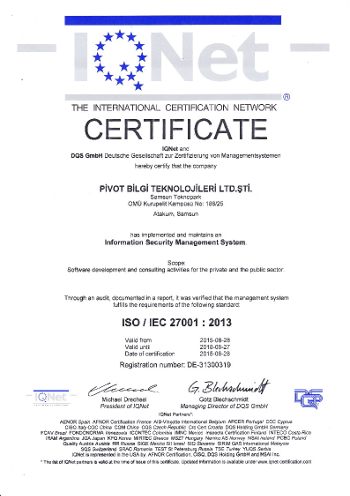
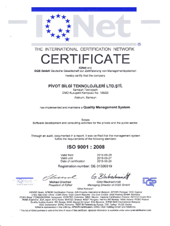

Mart ayından bu yana yoğun olarak emek vererek kurduğumuz ve hayata geçirdiğimiz Bilgi Güvenliği Yönetim Sistemimiz, Mayıs ayının sonlarında
denetlendi ve ISO 27001:2013 Bilgi Güvenliği sertifikasını almaya hak kazandık. Bu sertifika ile beraber ISO 9001:2018 Kalite Yönetimi sertifikasının da sahibi olduk.

Pivot Bilgi Teknolojileri olarak bu süreçte 100'ün üzerinde düzeltici faaliyet, 70'in üzerinde politika, 30'un üzerinde prosedür
oluşturduk. Başarılı bir denetim sürecinin ardından kusursuza yakın bir denetim sonucu aldık.

Yürüttüğümüz ve planladığımız yazılım geliştirme faaliyetlerinde bilgi güvenliği konusundaki hassasiyet, yetkinlik ve tecrübemizi bu sertifika ile ispatlamış olduk.

<figure>
  
  
  <figcaption>ISO-27001:2013 Bilgi Güvenliği ve ISO-9001:2008 Kalite Yönetimi Sertifikasına sahibiyiz.</figcaption>
</figure>

Sizlerle paylaşmaktan gurur ve mutluluk duyuyoruz.
